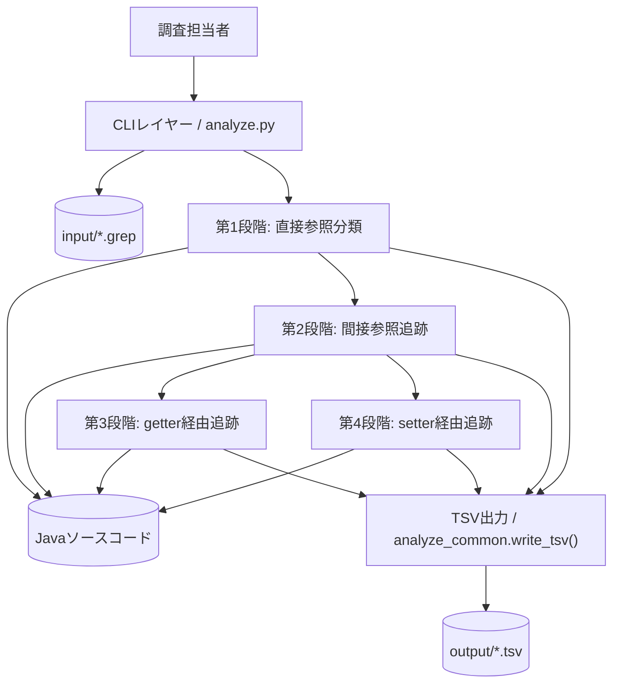
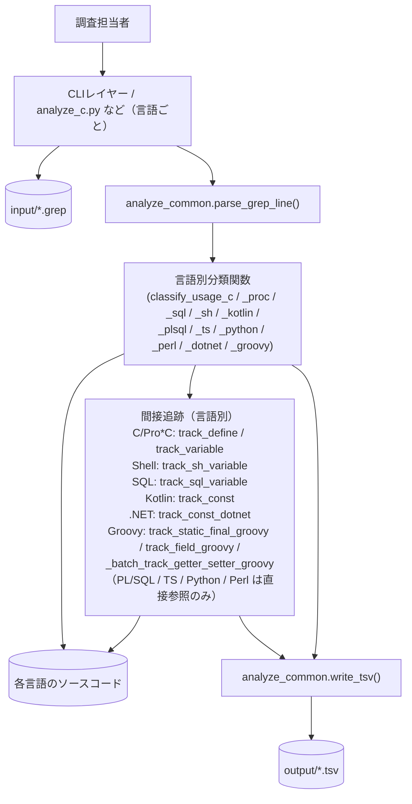
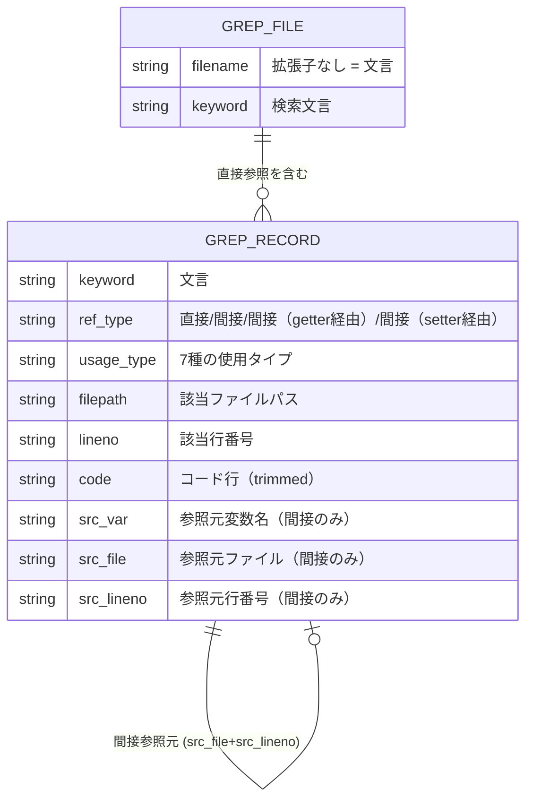
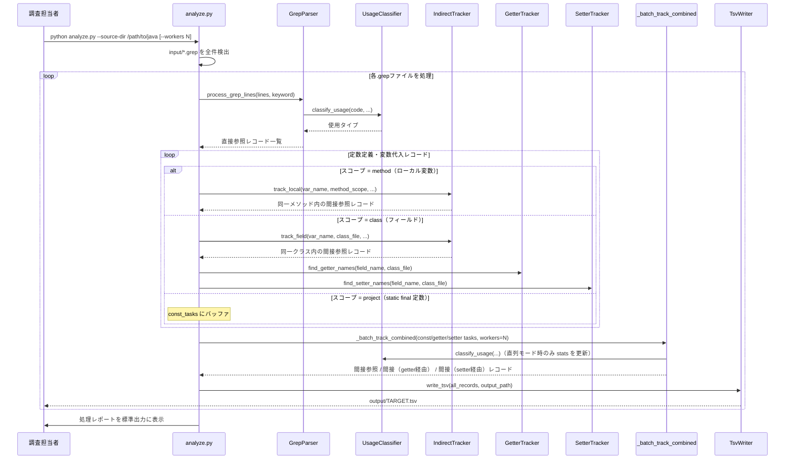
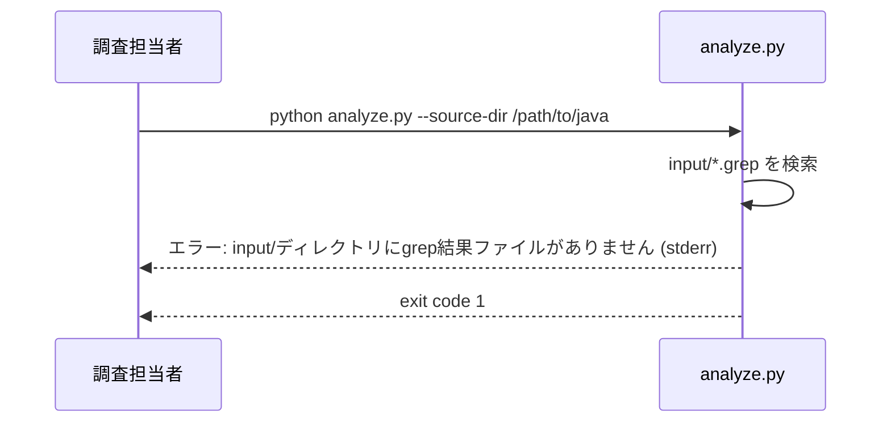

# 機能設計書 (Functional Design Document)

## システム構成図

### Java（analyze.py）— 4段階分析



### Java 以外の言語 — 直接参照 + 言語別の間接追跡



## 技術スタック

| 分類 | 技術 | 選定理由 |
|------|------|----------|
| 言語 | Python 3.12+ | 標準ライブラリが充実。venvによる軽量zip配布が可能 |
| AST解析 | javalang（`analyze.py` のみ） | Java 7以上のソースをPythonからAST解析できる唯一の実績あるライブラリ |
| 言語別分類 | re（標準ライブラリ） | Java 以外（C/Pro*C/SQL/Shell/Kotlin/PL/SQL/TS/Python/Perl/.NET/Groovy）はすべて正規表現のみで分類完結。外部依存不要 |
| 文字コード推定 | chardet（`requirements.txt` 必須） | grep 結果 / ソースファイルの文字コード自動検出。万一未インストールなら cp932 フォールバック |
| 多パターン検索 | pyahocorasick（`requirements.txt` 必須） + 同梱純Python実装 | 一括追跡時のパターン数 ≥ 100 で Aho-Corasick に自動切替。万一未インストールなら同梱の `aho_corasick.py` 純Python実装にフォールバック |
| TSV出力 | csv（標準ライブラリ） | タブ区切り・BOM付きUTF-8出力をネイティブサポート |
| 大規模ソート | heapq（標準ライブラリ） | 100万件超のレコードをチャンク分割+ヒープマージで外部ソート |
| CLIパース | argparse（標準ライブラリ） | --source-dir等のオプション解析に十分 |
| 配布 | venv + zip | 解凍→venv作成→`python analyze.py` で即使用可能 |

## データモデル定義

### エンティティ: GrepRecord

```python
from dataclasses import dataclass, field
from enum import Enum

class RefType(Enum):
    DIRECT = "直接"
    INDIRECT = "間接"
    GETTER = "間接（getter経由）"
    SETTER = "間接（setter経由）"

class UsageType(Enum):
    ANNOTATION = "アノテーション"
    CONSTANT   = "定数定義"
    VARIABLE   = "変数代入"
    CONDITION  = "条件判定"
    RETURN     = "return文"
    ARGUMENT   = "メソッド引数"
    OTHER      = "その他"

class GrepRecord(NamedTuple):
    keyword:    str       # 検索した文言（入力ファイル名から取得）
    ref_type:   str       # 参照種別（RefType.value）
    usage_type: str       # 使用タイプ（UsageType.value）
    filepath:   str       # 該当行のファイルパス
    lineno:     str       # 該当行の行番号
    code:       str       # 該当行のコード（前後の空白はtrim済み）
    src_var:    str = ""  # 間接参照の場合：経由した変数/定数名
    src_file:   str = ""  # 間接参照の場合：変数/定数が定義されたファイルパス
    src_lineno: str = ""  # 間接参照の場合：変数/定数が定義された行番号
```

**制約**:
- `NamedTuple` でイミュータブルに保つ
- 直接参照の場合 `src_var` / `src_file` / `src_lineno` は空文字列
- `ref_type` の取りうる値: `直接` / `間接` / `間接（getter経由）` / `間接（setter経由）`
- `usage_type` の取りうる値: 7種のいずれか（分類不能時は `その他`）

### エンティティ: ProcessStats（処理レポート用）

```python
@dataclass
class ProcessStats:
    total_lines:     int = 0   # grep結果ファイルから読み込んだ総行数（コメント行含む）
    valid_lines:     int = 0   # パース成功行数。total_lines = valid_lines + skipped_lines が常に成立
                               # ※ 間接参照・getter経由で追加されたレコードはカウント対象外
    skipped_lines:   int = 0   # スキップ行数（バイナリ通知・空行・不正形式）
    fallback_files:  set[str] = field(default_factory=set)   # ASTフォールバックしたファイル（O(1) membership）
    encoding_errors: set[str] = field(default_factory=set)   # エンコーディングエラーのファイル（O(1) membership）
```

### ER図



## コンポーネント設計

### F-01: GrepParser（grep結果パーサー）

**責務**:
- `input/` ディレクトリ内の `.grep` ファイルを全て検出する
- grep行 `filepath:lineno:code` をパースする
- バイナリ通知行・空行・不正フォーマット行をスキップしてカウントする

**インターフェース**:
```python
def parse_grep_line(line: str) -> dict | None:
    """grep結果の1行をパースする。不正行はNoneを返す。
    対応フォーマット: 'filepath:lineno:code'
    Windowsパス対応: re.split(r':(\d+):', line, maxsplit=1) を使用
    """

def process_grep_file(path: Path, keyword: str, source_dir: Path, stats: ProcessStats,
                      *, encoding_override: str | None = None) -> list[GrepRecord]:
    """grepファイル全行を処理し、第1段階（直接参照）レコードのリストを返す。
    grep結果ファイル / ソースファイルともに `analyze_common.detect_encoding()` で
    自動検出する（chardet で先頭 4096 バイトを推定。フォールバックは cp932）。
    `--encoding` で強制指定された場合はそれを優先する。
    すべての読み込みは `errors='replace'` で継続する。
    """
```

**依存関係**: `re`（標準ライブラリ）, `ProcessStats`, `analyze_common.detect_encoding/iter_grep_lines`

---

### F-02: UsageClassifier（使用タイプ分類器）

**責務**:
- `javalang` によるAST解析で7種の使用タイプに分類する
- `javalang` パースエラー時は正規表現フォールバックで継続する
- 第1段階（直接参照）・第2段階（間接参照）・第3段階（getter経由）の全てで使用

**インターフェース**:
```python
def classify_usage(code: str, filepath: str, lineno: int,
                   source_dir: Path,
                   stats: ProcessStats) -> str:
    """コード行を解析し、使用タイプ文字列を返す。
    1. javalangでAST解析を試みる（モジュールレベルのASTキャッシュを利用）
    2. パースエラーの場合は正規表現フォールバック
    """

def classify_usage_regex(code: str) -> str:
    """正規表現で使用タイプを分類する（フォールバック専用）。
    優先度順に評価: アノテーション > 定数定義 > 条件判定 >
                   return文 > 変数代入 > メソッド引数 > その他
    """
```

**分類ルール（優先度順）**:

| 優先度 | 使用タイプ | 検出パターン（正規表現フォールバック） |
|--------|----------|--------------------------------------|
| 1 | アノテーション | `@\w+\s*\(` |
| 2 | 定数定義 | `\bstatic\s+final\b` |
| 3 | 条件判定 | `\bif\s*\(|\bwhile\s*\(|\.equals\s*\(|[!=]=` |
| 4 | return文 | `\breturn\b` |
| 5 | 変数代入 | `\b\w[\w<>[\]]*\s+\w+\s*=` |
| 6 | メソッド引数 | `\w+\s*\(` |
| 7 | その他 | 上記すべてに非マッチ（コメント行も含む） |

**注記**: F-03（IndirectTracker）・F-04（GetterTracker）の内部からも呼び出される共通ユーティリティ

**依存関係**: `javalang`, `re`, `ProcessStats`, `ASTCache`

---

### F-03: IndirectTracker（間接参照追跡器）

**責務**:
- 第1段階で「定数定義」「変数代入」に分類された行から変数名を抽出する
- 変数の種類に応じてスコープを決定し、参照箇所を追跡する
- 各参照箇所を `UsageClassifier` で分類する

**追跡スコープ判定**:

| 変数の種類 | 判定条件 | 追跡スコープ |
|-----------|---------|-------------|
| 定数（`static final`） | コードに `static final` を含む | プロジェクト全体 |
| インスタンス変数（フィールド） | クラスメンバー宣言パターン | 同一クラス内 + getter経由 |
| ローカル変数 | メソッド内宣言パターン | 同一メソッド内 |

**インターフェース**:
```python
def determine_scope(usage_type: str, code: str, filepath: str = "",
                    source_dir: Path | None = None, lineno: int = 0) -> str:
    """変数の種類に応じた追跡スコープを返す。
    javalangが利用可能な場合はASTで判定（パッケージプライベートフィールドも正確に判定）。
    AST不可の場合は正規表現フォールバック。
    Returns: "project"（定数）/ "class"（フィールド）/ "method"（ローカル変数）
    詳細なロジックはアルゴリズム設計セクションを参照。
    """

def extract_variable_name(code: str, usage_type: str) -> str | None:
    """定数/変数の名前をコード行から抽出する。"""

def track_constant(var_name: str, source_dir: Path, origin: GrepRecord,
                   stats: ProcessStats) -> list[GrepRecord]:
    """static finalの定数をプロジェクト全体で追跡する。"""

def track_field(var_name: str, class_file: Path, origin: GrepRecord,
                source_dir: Path, stats: ProcessStats) -> list[GrepRecord]:
    """フィールドを同一クラス内で追跡する。"""

def track_local(var_name: str, method_scope: tuple[int, int], origin: GrepRecord,
                source_dir: Path, stats: ProcessStats) -> list[GrepRecord]:
    """ローカル変数を同一メソッド内で追跡する。
    method_scope: (開始行番号, 終了行番号) のタプルでメソッドの行範囲を指定する。
    """
```

**依存関係**: `UsageClassifier`, `ASTCache`, `javalang`

---

### F-04: GetterTracker（getter経由追跡器）

**責務**:
- フィールドの同一クラス内からgetter候補を特定する（2方法の併用）
- プロジェクト全体でgetter呼び出し箇所を検索・分類する

**getter候補特定の2方法**:
1. **命名規則**: フィールド名 `type` → `getType()` のメソッドを探す
2. **return文解析**: `return フィールド名;` しているメソッドを全て拾う（非標準命名も対象）

**インターフェース**:
```python
def find_getter_names(field_name: str, class_file: Path) -> list[str]:
    """クラスファイルからgetterメソッド名の候補リストを返す。
    命名規則パターン + return文解析の2方式を併用。
    モジュールレベルの _ast_cache を利用してファイルを再解析しない。
    """

def track_getter_calls(getter_name: str, source_dir: Path, origin: GrepRecord,
                       stats: ProcessStats) -> list[GrepRecord]:
    """プロジェクト全体でgetter呼び出し箇所を検索・AST分類する。
    false positiveは許容（もれなく優先）。
    参照種別 = 間接（getter経由） として出力。
    """
```

**依存関係**: `UsageClassifier`, `ASTCache`, `javalang`

---

### F-04b: SetterTracker（setter経由追跡器）

**責務**:
- フィールドの同一クラス内からsetter候補を特定する（2方法の併用）
- プロジェクト全体でsetter呼び出し箇所を検索・分類する

**setter候補特定の2方法**:
1. **命名規則**: フィールド名 `type` → `setType()` のメソッドを探す
2. **代入文解析**: `this.フィールド名 = 引数;` しているメソッドを全て拾う（非標準命名も対象）

**インターフェース**:
```python
def find_setter_names(field_name: str, class_file: Path) -> list[str]:
    """クラスファイルからsetterメソッド名の候補リストを返す。
    命名規則パターン + this.field代入解析の2方式を併用。
    モジュールレベルの _ast_cache を利用してファイルを再解析しない。
    """

def track_setter_calls(setter_name: str, source_dir: Path, origin: GrepRecord,
                       stats: ProcessStats) -> list[GrepRecord]:
    """プロジェクト全体でsetter呼び出し箇所を検索・AST分類する。
    false positiveは許容（もれなく優先）。
    参照種別 = 間接（setter経由） として出力。
    """
```

**バッチ処理**:
```python
def _batch_track_setters(
    tasks: dict[str, list[GrepRecord]],
    source_dir: Path,
    stats: ProcessStats,
    file_list: list[Path] | None = None,
    *,
    encoding_override: str | None = None,
) -> list[GrepRecord]:
    """複数のsetterをプロジェクト全体で一括追跡する（1回のファイル走査で全setter名を同時検索）。"""

# 実際の Java メイン処理では、定数・getter・setter を 1 パスで統合スキャンする
# `_batch_track_combined` を使用する（`_batch_track_constants` / `_batch_track_getters`
# / `_batch_track_setters` は file_list 共有を受けつつ単独追跡が可能なヘルパとして残置）。
def _batch_track_combined(
    const_tasks: dict[str, list[GrepRecord]],
    getter_tasks: dict[str, list[GrepRecord]],
    setter_tasks: dict[str, list[GrepRecord]],
    source_dir: Path,
    stats: ProcessStats,
    file_list: list[Path] | None = None,
    *,
    encoding_override: str | None = None,
    workers: int = 1,
) -> list[GrepRecord]:
    """const / getter / setter を 1 パスで統合追跡する。
    workers >= 2 のときは ProcessPoolExecutor でファイルを n 等分して並列スキャン。"""
```

**依存関係**: `UsageClassifier`, `ASTCache`, `javalang`

---

### F-05: TsvWriter（TSV出力）

**責務**:
- GrepRecordのリストをUTF-8 BOM付きTSVに書き出す
- ソート順: `(keyword, filepath, int(lineno))` の 3 キー昇順（lineno は数値変換）
- `output/` ディレクトリが存在しない場合は自動作成する
- 大規模出力（`_EXTERNAL_SORT_THRESHOLD = 1_000_000` 件超）は `heapq.merge` ベースの外部ソートに切り替える

**インターフェース**:
```python
def write_tsv(records: list[GrepRecord], output_path: Path) -> None:
    """GrepRecordのリストをUTF-8 BOM付きTSVに出力する。
    ヘッダー: 文言,参照種別,使用タイプ,ファイルパス,行番号,コード行,
              参照元変数名,参照元ファイル,参照元行番号
    エンコード: utf-8-sig（Excel対応BOM付き）
    ソート実装:
        sort_key = (r.keyword, r.filepath, int(r.lineno) if r.lineno.isdigit() else 0)
        ※ lineno は str 型のため int() 変換して数値ソートすること（"10" < "9" バグ防止）
        100万件超の場合は 50万件ごとにチャンク分割→tempfile に書き出し→heapq.merge で結合する。
    """
```

**出力列定義**:

| 列名 | GrepRecordフィールド | 備考 |
|------|---------------------|------|
| 文言 | `keyword` | 入力ファイル名から取得 |
| 参照種別 | `ref_type` | 直接/間接/間接（getter経由）/間接（setter経由） |
| 使用タイプ | `usage_type` | 7種のいずれか |
| ファイルパス | `filepath` | 該当行のファイルパス |
| 行番号 | `lineno` | 該当行の行番号 |
| コード行 | `code` | trimした該当行コード |
| 参照元変数名 | `src_var` | 間接参照時のみ |
| 参照元ファイル | `src_file` | 間接参照時のみ |
| 参照元行番号 | `src_lineno` | 間接参照時のみ |

---

### F-06: Reporter（処理レポート）

**責務**:
- 処理完了後に標準出力へサマリを出力する

**インターフェース**:
```python
def print_report(stats: ProcessStats, processed_files: list[str]) -> None:
    """処理サマリを標準出力に出力する。全ファイル処理完了後に1回呼び出す。
    processed_files: 処理した .grep ファイル名のリスト（サマリ表示用）
    出力内容:
    - 処理したファイル一覧
    - 総行数・有効行数・スキップ行数
    - ASTフォールバックしたファイル一覧（あれば）
    - エンコーディングエラーのファイル一覧（あれば）
    """
```

---

### ASTCache（Javaアナライザー専用キャッシュ）

**責務**:
- 同一Javaファイルの繰り返しAST解析を省略する
- プロセス全体で共有するモジュールレベルのdict（`analyze.py` 内のみ）

```python
# モジュールレベルで定義。`analyze.py`（メイン）プロセス内のキャッシュ。
# `--workers` 並列モードでは ProcessPoolExecutor で worker プロセス毎に
# キャッシュが再構築されるトレードオフがある（ロック不要）。
_ast_cache: dict[str, object | None] = {}
# None = パースエラーが発生したファイル（フォールバック対象）

# ASTインデックスキャッシュ: filepath → {lineno: (usage_type | None, scope | None)}
# usage_type: UsageType.value, scope: "class" | "method" | None
_ast_line_index: dict[str, dict[int, tuple[str | None, str | None]]] = {}

# メソッド開始行キャッシュ: filepath → sorted list of method start line numbers
_method_starts_cache: dict[str, list[int]] = {}

# キャッシュ上限（大規模プロジェクトでのOOM防止。LRU 風に最古エントリを破棄）
_MAX_AST_CACHE_SIZE = 2000  # 60GB規模対応（~2-6GB使用。メモリ不足時は500〜1000に調整）
```

---

### FileCache（全言語共通ファイル行キャッシュ）

**責務**:
- 各言語アナライザーで同一ファイルの繰り返し読み込みを省略する
- 実体は `analyze_common.py` の `_file_lines_cache`（プロセス内シングルトン OrderedDict）。
  全言語アナライザーは `cached_file_lines(path, encoding, stats)` 経由で同一キャッシュを共有する
- 行数ではなくおおよそのバイト数（行長 + 64バイト/行のオーバーヘッド）で見積もり、
  バイト上限を超過したら最古エントリから破棄する LRU 動作

```python
# analyze_common.py 内
from collections import OrderedDict

_file_lines_cache: OrderedDict[str, list[str]] = OrderedDict()
_file_lines_cache_bytes: int = 0
_file_lines_cache_limit: int = 256 * 1024 * 1024  # 256MB（set_file_lines_cache_limit で変更可）

def cached_file_lines(path: Path, encoding: str, stats: ProcessStats | None = None) -> list[str]:
    """ファイルの行リストをサイズベース LRU キャッシュ経由で返す。"""
```

---

### grep_filter_files（`analyze_common.py`）

**責務**:
- バッチスキャン前に `mmap` バイト列検索で対象ファイルを絞り込む
- 識別子名（ASCII）をバイト列として検索し、1つでもヒットするファイルのみ返す（スーパーセット、false negative ゼロ）
- Solaris 10 / Windows を含む全 OS で動作（Python 標準ライブラリのみ）

```python
def grep_filter_files(
    names: list[str],      # 検索する識別子のリスト（ASCII）
    src_dir: Path,         # 検索対象ルートディレクトリ
    extensions: list[str], # 対象拡張子 例: [".java"], [".kt", ".kts"]
    label: str = "",       # 指定時は事前フィルタ結果を stderr に出力
) -> list[Path]:           # 絞り込み済みファイルリスト（ソート済み）
```

**呼び出し元**:  
- `analyze.py`: `main()` および `_batch_track_combined`（定数 / getter / setter を 1 パスで統合追跡）。
  `_batch_track_constants` / `_batch_track_getters` / `_batch_track_setters` も `file_list` 未指定時の事前フィルタとして利用する
- `analyze_all.py`: `_batch_track_kotlin_const`/`_batch_track_dotnet_const`/`_batch_track_groovy_static_final`/`_batch_track_define_c_all`/`_batch_track_define_proc_all` および統合パスの Java スキャン

**エラー時**: OSError / mmap.error / 空ファイルが発生したファイルはスキャン対象に含める（安全側フォールバック）

---

### F-07: 言語別アナライザー（Java 以外の全言語）

**責務（共通）**:
- grep行を `parse_grep_line()` でパースする（`analyze_common` から共有）
- 言語固有の正規表現パターンで使用タイプを分類する
- 結果を `GrepRecord` リストとして返し `write_tsv()` で出力する

**言語別使用タイプ**:

| 言語 | モジュール | 使用タイプ（種数） |
|------|-----------|-----------------|
| C | `analyze_c.py` | #define定数定義・条件判定・return文・変数代入・関数引数・その他（6種） |
| Pro*C | `analyze_proc.py` | EXEC SQL文・#define定数定義・条件判定・return文・変数代入・関数引数・その他（7種） |
| Oracle SQL | `analyze_sql.py` | 例外・エラー処理・定数・変数定義・WHERE条件・比較・DECODE・INSERT/UPDATE値・SELECT/INTO・その他（7種） |
| Shell | `analyze_sh.py` | 環境変数エクスポート・変数代入・条件判定・echo/print出力・コマンド引数・その他（6種） |
| Kotlin | `analyze_kotlin.py` | const定数定義・変数代入・条件判定・return文・アノテーション・関数引数・その他（7種） |
| PL/SQL | `analyze_plsql.py` | 定数/変数宣言・EXCEPTION処理・条件判定・カーソル定義・INSERT/UPDATE値・WHERE条件・その他（7種） |
| TypeScript/JavaScript | `analyze_ts.py` | const定数定義・変数代入(let/var)・条件判定・return文・デコレータ・関数引数・その他（7種） |
| Python | `analyze_python.py` | 変数代入・条件判定・return文・デコレータ・関数引数・その他（6種） |
| Perl | `analyze_perl.py` | use constant定義・変数代入・条件判定・print/say出力・関数引数・その他（6種） |
| C#/VB.NET | `analyze_dotnet.py` | 定数定義(Const/readonly)・変数代入・条件判定・return文・属性(Attribute)・メソッド引数・その他（7種） |
| Groovy | `analyze_groovy.py` | static final定数定義・変数代入・条件判定・return文・アノテーション・メソッド引数・その他（7種） |

**Pro*C 固有機能（拡張子ベースのディスパッチ）**:
```python
def _classify_for_filepath(code: str, filepath: str) -> str:
    ext = Path(filepath).suffix.lower()
    if ext in ('.c', '.h'):
        return classify_usage_c(code)   # analyze_c から import
    return classify_usage_proc(code)    # .pc ファイル向け
```

**間接参照追跡（C/Pro*C/Shell/SQL/Kotlin/C#・VB.NET/Groovy）**:
- C/Pro*C: `#define定数定義` → プロジェクト全体の `.c`/`.h`/`.pc` ファイルを追跡（`track_define()`）
- C/Pro*C: `変数代入` → 同一ファイル内を追跡（`track_variable()`）
- Shell: `変数代入` / `環境変数エクスポート` → 同一ファイル内を追跡（`track_sh_variable()`）
- SQL: `定数・変数定義` → 同一ファイル内を追跡（`track_sql_variable()`）
- Kotlin: `const定数定義` → プロジェクト全体の `.kt`/`.kts` ファイルを追跡（`track_const()`）
- C#/VB.NET: `const` / `static readonly` 定数定義 → プロジェクト全体の `.cs`/`.vb` ファイルを追跡（`track_const_dotnet()`）
- Groovy: `static final` 定数・フィールド → プロジェクト全体の `.groovy`/`.gvy` ファイルを追跡（`track_static_final_groovy()`）
- Groovy: getter/setter経由の呼び出し箇所追跡（`_batch_track_getter_setter_groovy()`）

## ユースケース図

### UC-01: grep結果ファイルの分析（メインフロー）



### UC-02: `input/` が空の場合



## アルゴリズム設計

### 使用タイプ分類アルゴリズム（正規表現フォールバック）

**優先度順パターンリスト**:
```python
import re

USAGE_PATTERNS: list[tuple[re.Pattern, str]] = [
    (re.compile(r'@\w+\s*\('),                               "アノテーション"),
    (re.compile(r'\bstatic\s+final\b'),                      "定数定義"),
    (re.compile(r'\bif\s*\(|\bwhile\s*\(|\.equals\s*\(|[!=]='), "条件判定"),
    (re.compile(r'\breturn\b'),                               "return文"),
    (re.compile(r'\b\w[\w<>\[\]]*\s+\w+\s*='),              "変数代入"),
    (re.compile(r'\w+\s*\('),                                 "メソッド引数"),
]

def classify_usage_regex(code: str) -> str:
    stripped = code.strip()
    for pattern, usage_type in USAGE_PATTERNS:
        if pattern.search(stripped):
            return usage_type
    return "その他"
```

### 間接参照追跡スコープ判定アルゴリズム

```python
def determine_scope(usage_type: str, code: str) -> str:
    """変数の種類に応じた追跡スコープを返す。"""
    if usage_type == "定数定義":
        return "project"   # static final → プロジェクト全体
    stripped = code.strip()
    # フィールド判定: クラスレベルの宣言（メソッド外）
    if re.match(r'(private|protected|public)?\s+\w[\w<>[\]]*\s+\w+\s*[=;]', stripped):
        return "class"     # インスタンス変数 → 同一クラス + getter
    return "method"        # ローカル変数 → 同一メソッド内
```

### getter候補特定アルゴリズム

```python
def find_getter_names(field_name: str, class_file: Path) -> list[str]:
    """
    2方式でgetter候補を特定:
    1. 命名規則: field_name="type" → "getType"
    2. return文解析: `return field_name;` しているメソッドを全て検出
    モジュールレベルの _ast_cache を利用してファイルを再解析しない。
    """
    candidates = []
    # 方式1: 命名規則（field_name="type" → "getType"）
    getter_by_convention = "get" + field_name[0].upper() + field_name[1:]
    candidates.append(getter_by_convention)
    # 方式2: ASTからreturn文を解析（javalangのAST walk）
    cache_key = str(class_file)
    if cache_key not in _ast_cache:
        try:
            source = class_file.read_text(
                encoding=detect_encoding(class_file, encoding_override), errors="replace",
            )
            _ast_cache[cache_key] = javalang.parse.parse(source)
        except Exception:
            _ast_cache[cache_key] = None
    tree = _ast_cache[cache_key]
    if tree:
        for _, method_decl in tree.filter(javalang.tree.MethodDeclaration):
            for _, stmt in method_decl.filter(javalang.tree.ReturnStatement):
                # `return field_name;` のパターンを検出
                if (stmt.expression is not None
                        and hasattr(stmt.expression, 'member')
                        and stmt.expression.member == field_name):
                    candidates.append(method_decl.name)
    return list(set(candidates))
```

## CLI設計

各言語アナライザーは独立したCLIエントリーポイントを持つ。全て `--source-dir`, `--input-dir`, `--output-dir` の同一オプション体系を共有する。

```bash
# Java
python analyze.py --source-dir /path/to/javaproject

# C
python analyze_c.py --source-dir /path/to/c/src

# Pro*C（.pc/.c 混在）
python analyze_proc.py --source-dir /path/to/proc/src

# SQL
python analyze_sql.py --source-dir /path/to/sql/src

# Shell
python analyze_sh.py --source-dir /path/to/shell/src

# Kotlin
python analyze_kotlin.py --source-dir /path/to/kotlin/src

# PL/SQL
python analyze_plsql.py --source-dir /path/to/plsql/src

# TypeScript/JavaScript
python analyze_ts.py --source-dir /path/to/ts/src

# Python
python analyze_python.py --source-dir /path/to/python/src

# Perl
python analyze_perl.py --source-dir /path/to/perl/src

# C#/VB.NET
python analyze_dotnet.py --source-dir /path/to/dotnet/src

# Groovy
python analyze_groovy.py --source-dir /path/to/groovy/src

# 多言語一括（拡張子から言語を判定してディスパッチ。--workers 並列対応）
python analyze_all.py --source-dir /path/to/mixed/src --workers 8

# オプション指定（全言語共通）
python analyze_proc.py --source-dir /path/to/src \
       --input-dir /custom/input \
       --output-dir /custom/output

# 文字コード強制指定（全言語アナライザーで利用可能）
python analyze_kotlin.py --source-dir /path/to/src --encoding utf-8
```

**argparse定義（全言語共通パターン）**:
```python
def build_parser() -> argparse.ArgumentParser:
    parser = argparse.ArgumentParser(
        description="[言語] grep結果 自動分類・使用箇所洗い出しツール"
    )
    parser.add_argument("--source-dir", required=True,
                        help="解析対象ソースコードのルートディレクトリ")
    parser.add_argument("--input-dir", default="input",
                        help="grep結果ファイルの配置ディレクトリ（デフォルト: input/）")
    parser.add_argument("--output-dir", default="output",
                        help="TSV出力先ディレクトリ（デフォルト: output/）")
    parser.add_argument("--encoding", default=None,
                        help="文字コード強制指定（省略時は自動検出）")
    # --workers は analyze.py / analyze_all.py / analyze_plsql.py / analyze_python.py /
    # analyze_perl.py / analyze_ts.py / analyze_sh.py / analyze_sql.py が定義する。
    # analyze_c.py / analyze_proc.py / analyze_kotlin.py / analyze_dotnet.py / analyze_groovy.py
    # は単独 CLI では並列化対象外で、並列実行は `python analyze_all.py --workers N` を案内する。
    parser.add_argument("--workers", type=int, default=1,
                        help=f"並列ワーカー数（デフォルト: 1, 推奨: {os.cpu_count() or 4}）")
    return parser
```

## ファイル構造

```
input/
├── .gitkeep
└── TARGET.grep       # grep -rn "TARGET" /java > input/TARGET.grep

output/
├── .gitkeep
└── TARGET.tsv        # 分析結果TSV（自動生成）
```

**TSVフォーマット例**:
```tsv
文言	参照種別	使用タイプ	ファイルパス	行番号	コード行	参照元変数名	参照元ファイル	参照元行番号
TARGET	直接	定数定義	Constants.java	10	public static final String CODE = "TARGET"
TARGET	間接	条件判定	Service.java	110	if (someVar.equals(CODE)) {	CODE	Constants.java	10
TARGET	間接（getter経由）	メソッド引数	Handler.java	55	someService.process(obj.getCode());	getCode	Entity.java	8
TARGET	直接	条件判定	Validator.java	80	if (x.equals("TARGET")) {
```

## パフォーマンス最適化

- **ASTキャッシュ**: `_ast_cache: dict[str, object | None]` でファイルごとにキャッシュ。同一ファイルの再解析を完全省略
- **AST 行インデックス**: `_ast_line_index` で `(usage_type, scope)` を O(1) 参照
- **ファイル行キャッシュ**: `analyze_common._file_lines_cache`（バイト数ベース LRU、上限 256MB）を全言語で共有
- **ソースファイル一覧キャッシュ**: `iter_source_files` が `(src_dir, extensions)` 単位で `rglob` 結果を再利用
- **mmap 事前フィルタ**: `grep_filter_files()` でバッチスキャン前に対象ファイルをバイト列検索で絞り込む
- **バッチスキャナ**: `build_batch_scanner(patterns, threshold=100)` がパターン数に応じて
  combined regex / Aho-Corasick（`pyahocorasick` または `aho_corasick.AhoCorasick` の純 Python 実装）を自動選択
- **並列スキャン**: `--workers >= 2` で `_batch_track_combined` を `ProcessPoolExecutor` 並列化
- **ジェネレータ**: 大量のgrep行をメモリ効率良く処理（`for line in f:` でストリーミング）
- **プリコンパイル正規表現**: `USAGE_PATTERNS` は起動時に一度コンパイル
- **外部ソート**: `write_tsv` は 100万件超で `heapq.merge` ベースの外部ソートに切り替え

## セキュリティ考慮事項

- **入力検証**: `--source-dir` / `--input-dir` の存在・ディレクトリ確認
- **エンコーディング**: `errors='replace'` でファイル読み込み継続（文字化けは許容）
- **ファイルサイズ**: 500MB超のgrep結果ファイルは警告を出力

## エラーハンドリング

| エラー種別 | 処理 | ユーザーへの表示 |
|-----------|------|-----------------|
| `--source-dir` 未指定 | exit code 1 | `エラー: --source-dir は必須です` (stderr) |
| `--source-dir` 不在/非ディレクトリ | exit code 1 | `エラー: --source-dir で指定したディレクトリが存在しません: [パス]` (stderr) |
| `--input-dir` 不在/非ディレクトリ | exit code 1 | `エラー: --input-dir で指定したディレクトリが存在しません: [パス]` (stderr) |
| `input/` が空/不在 | exit code 1 | `エラー: input/ディレクトリにgrep結果ファイルがありません` (stderr) |
| バイナリ通知行 | スキップ・`stats.skipped_lines++` | 処理完了後サマリに件数記録 |
| ASTパースエラー | 正規表現フォールバック・`stats.fallback_files.add(...)` | 処理完了後サマリに記録 |
| エンコーディングエラー | `errors='replace'` で継続・`stats.encoding_errors.add(...)` | 処理完了後サマリに記録 |
| `output/` 不在 | `output_dir.mkdir(parents=True, exist_ok=True)` で自動作成 | なし |
| 予期しない例外 | exit code 2 | `予期しないエラー: [詳細]` (stderr) |

## テスト戦略

### ユニットテスト

| テストファイル | 対象モジュール | 主要テスト対象 |
|-------------|------------|------------|
| `tests/test_analyze.py` | `analyze.py`（Java） | `parse_grep_line()`, `classify_usage_regex()`, `extract_variable_name()`, `write_tsv()` |
| `tests/test_analyze_proc.py` | `analyze_proc.py`（Pro*C） | `classify_usage_proc()`, `track_define()`, Pro*CE2Eフロー |
| `tests/test_common.py` | `analyze_common.py` | `parse_grep_line()`, `write_tsv()`, 共通データモデル |
| `tests/test_c_analyzer.py` | `analyze_c.py` | C E2Eフロー（直接参照 + #define間接参照） |
| `tests/test_sh_analyzer.py` | `analyze_sh.py` | Shell E2Eフロー |
| `tests/test_sql_analyzer.py` | `analyze_sql.py` | SQL E2Eフロー |
| `tests/test_kotlin_analyzer.py` | `analyze_kotlin.py` | Kotlin E2Eフロー（直接参照 + const val間接参照） |
| `tests/test_plsql_analyzer.py` | `analyze_plsql.py` | PL/SQL E2Eフロー（直接参照） |
| `tests/test_ts_analyzer.py` | `analyze_ts.py` | TypeScript/JS E2Eフロー（直接参照） |
| `tests/test_python_analyzer.py` | `analyze_python.py` | Python E2Eフロー（直接参照） |
| `tests/test_perl_analyzer.py` | `analyze_perl.py` | Perl E2Eフロー（直接参照） |
| `tests/test_dotnet_analyzer.py` | `analyze_dotnet.py` | C#/VB.NET E2Eフロー（直接参照 + const/static readonly間接参照） |
| `tests/test_groovy_analyzer.py` | `analyze_groovy.py` | Groovy E2Eフロー（直接参照 + static final間接参照 + setter追跡） |
| `tests/test_aho_corasick.py` | `aho_corasick.py` | AhoCorasick の単語境界マッチ・複数パターン同時検索 |
| `tests/test_all_analyzer.py` | `analyze_all.py` | 多言語ディスパッチ・統合追跡パイプラインの E2E |

### 統合テスト（E2Eテスト）

各言語について、フィクスチャ（`tests/[言語]/`）を使ったE2Eフローを検証する:
- 直接参照が正しくTSVに出力されること
- 間接参照（C/Pro*Cのみ）が正しく追跡されること
- 期待TSVと実際の出力の全行一致確認（網羅率KPI）

### テスト実行

```bash
# 全テスト実行
python -m pytest tests/ -v
```
