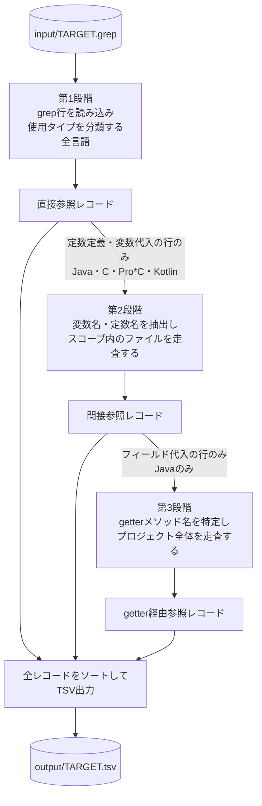
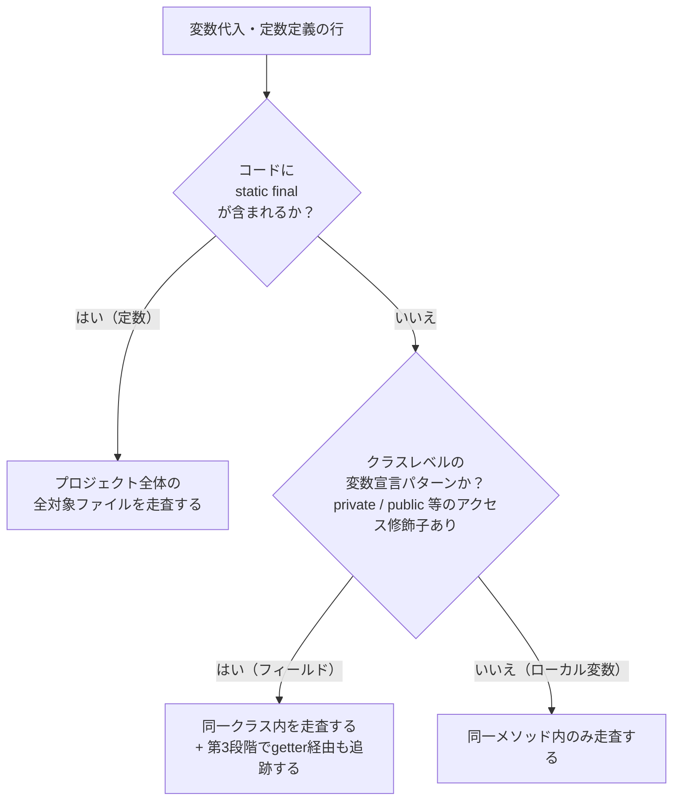
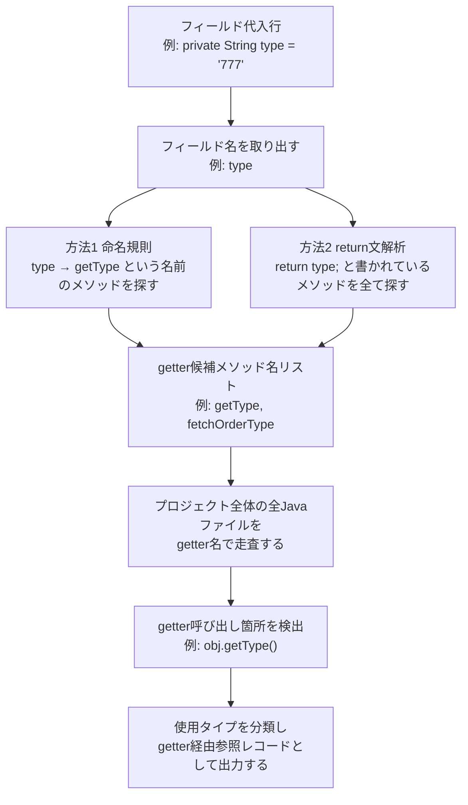

# ツール概要説明書

**対象読者**: プログラムの実装詳細を把握していない管理者・業務担当者  
**更新日**: 2026-04-19

---

## 1. このツールが存在する理由

大規模なシステムの改修・廃止作業において、「特定の値（コード値・ステータス値など）が、現在のプログラムのどこでどのように使われているか」を全件把握することが必要になる場面がある。

たとえば、注文ステータスを表す値 `"777"` という文字列を廃止したいとする。この値がシステム内のどのファイルの何行目にあるかを人手で確認するのは、ファイルが数千〜数万に及ぶ場合には現実的でない。

このツールは、その調査作業を自動化し、結果をExcelで開けるTSVファイルとして出力する。

---

## 2. grepとは何か

**grep** は、指定したディレクトリ以下の全ファイルを対象に、指定した文字列が含まれる行を検索するコマンドラインツールである。検索結果は以下の形式で出力される。

```
ファイルパス:行番号:その行のコード内容
```

例：

```
src/main/java/Constants.java:10:    public static final String CODE = "777";
src/main/java/Service.java:30:    if (x.equals("777")) {
src/main/java/Handler.java:55:    log.info("status: 777");
```

grepは「文字列として一致する行」を列挙するだけであり、その行がプログラム上でどういう意味を持つか（定数の定義なのか、条件判定に使われているのか、など）は出力しない。また、値を直接書かずに定数・変数を経由して使っている箇所は、grepでは検出できない。

このツールはそのgrepの結果ファイルを入力として受け取り、後述する処理を加えて詳細な一覧を生成する。

---

## 3. ツールが行う処理の全体像

処理は以下の3段階で構成される。なお、第2・第3段階はプログラミング言語によって実施の有無が異なる。

| 段階 | 処理内容 | 対応言語 |
|------|---------|---------|
| 第1段階 | grepでヒットした各行を読み込み、その行が「定数の定義」「条件判定」「変数への代入」など何に使われているかを分類する | 全言語 |
| 第2段階 | 第1段階で「定数定義」または「変数への代入」と判定された行を起点に、その定数・変数が使われている別の箇所を追跡して追加出力する | Java / C / Pro\*C / Kotlin |
| 第3段階 | 第2段階でフィールド（クラス内部の変数）への代入と判定された行を起点に、そのフィールドの値を返すgetterメソッドの呼び出し箇所を追跡して追加出力する | Javaのみ |

各段階の詳細は以下のセクションで説明する。



---

## 4. 第1段階：直接参照の検出と分類

### 4-1. 「直接参照」の意味

grepの結果に含まれる行は、調査対象の文字列（例：`"777"`）がコード上に直接記述されている行である。これを「直接参照」と呼ぶ。

### 4-2. 使用タイプへの分類

grepの出力はただの行の羅列であり、その行がプログラム上でどういう役割を持つかは示されていない。ツールはその行の内容を解析し、言語ごとに定義された「使用タイプ」に分類する。

分類の仕組みは言語によって異なる。

**Java（`analyze.py`）の場合**:

Javaのソースコードは「抽象構文木（AST）」と呼ばれる構造に変換して解析する。ASTとは、プログラムのテキストを構文規則に従って解析し、木構造（階層構造）で表現したものである。たとえば `if (x.equals("777"))` という1行は、ASTとして解析すると「if文の条件式の中にメソッド呼び出しがあり、その引数に文字列リテラルがある」という構造として表現される。この構造を参照することで、その行が「条件判定」であると判定できる。

AST解析が何らかの理由（文法エラーを含むファイル等）で失敗した場合は、正規表現（文字列パターンの一致による判定）で代替処理する。

**その他の言語（C / Pro\*C / Kotlin / PL/SQL / SQL / Shell）の場合**:

正規表現のみで分類する。正規表現とは、特定のパターンを持つ文字列を検出するための記述形式である。例として、Cの `#define ORDER_STATUS "777"` という行が「#define定数定義」であることは、「行頭付近に `#define` というキーワードがある」というパターンの一致で検出できる。

各言語の使用タイプ一覧は以下のとおりである。

| 言語 | 使用タイプの種類 |
|------|---------------|
| Java | アノテーション / 定数定義 / 変数代入 / 条件判定 / return文 / メソッド引数 / その他 |
| C | #define定数定義 / 条件判定 / return文 / 変数代入 / 関数引数 / その他 |
| Pro\*C | EXEC SQL文 / #define定数定義 / 条件判定 / return文 / 変数代入 / 関数引数 / その他 |
| Kotlin | const定数定義 / 変数代入 / 条件判定 / return文 / アノテーション / 関数引数 / その他 |
| PL/SQL | 定数/変数宣言 / EXCEPTION処理 / 条件判定 / カーソル定義 / INSERT/UPDATE値 / WHERE条件 / その他 |
| Oracle SQL | 例外・エラー処理 / 定数・変数定義 / WHERE条件 / 比較・DECODE / INSERT/UPDATE値 / SELECT/INTO / その他 |
| Shell | 環境変数エクスポート / 変数代入 / 条件判定 / echo/print出力 / コマンド引数 / その他 |

分類できないものは「その他」として必ず出力する（見落としを防ぐためスキップしない）。

---

## 5. 第2段階：間接参照の追跡（Java / C / Pro\*C / Kotlin）

### 5-1. 「間接参照」が発生する状況

grepは「調査対象の文字列が直接記述されている行」しか検出しない。しかし実際のプログラムでは、その文字列を一度定数や変数に格納し、その後は定数・変数名を使ってその値を参照するコーディングが広く行われている。

例（Java）：

```java
// ファイル：Constants.java の10行目
// "777" という文字列を CODE という名前の定数に格納している
public static final String CODE = "777";

// ファイル：Service.java の110行目
// "777" とは書かれていないが、CODE を経由して同じ値を参照している
if (someVar.equals(CODE)) { ... }
```

`Service.java` の110行目は `grep -rn "777"` を実行しても検出されない。しかし `CODE` を経由して `"777"` という値に関係しているため、調査対象として出力する必要がある。これを「間接参照」と呼ぶ。

### 5-2. 間接参照の追跡手順

第1段階で「定数定義」または「変数代入」に分類された行を起点として、以下の手順で追跡する。

**ステップ1：変数名・定数名の抽出**

第1段階の分類結果と、その行のコード内容を解析し、定義されている変数名・定数名を取り出す。上の例では `CODE` が取り出される。

**ステップ2：追跡スコープの決定**

変数の種類によって、追跡する範囲（スコープ）が異なる。誤ヒットを防ぐために範囲を絞る。

| 変数の種類 | 判定方法（Java） | 追跡範囲 |
|-----------|---------------|---------|
| 定数（`static final` 付き宣言） | コードに `static final` が含まれる | プロジェクト全体の全Javaファイル |
| フィールド（クラスの内部変数） | クラスレベルの変数宣言パターンに一致 | 同一クラス内（同一ファイル内） |
| ローカル変数（メソッド内の変数） | 上記以外の変数宣言 | 同一メソッド内（同一ファイルの一部範囲） |

ローカル変数の追跡範囲を狭くする理由：ローカル変数には `i`、`s`、`code` など汎用的な名前が使われることが多く、プロジェクト全体を追跡すると無関係の箇所が大量にヒットする。



**ステップ3：追跡対象ファイルを全行スキャン**

決定したスコープの範囲内で、全行を読み込み、ステップ1で取り出した変数名・定数名が出現する行を検出する。

**ステップ4：検出した行を分類して出力**

第1段階と同じ方法で使用タイプを分類し、結果を「間接参照」として出力する。この際、どの変数・定数を経由したか（`CODE`）、その変数・定数が定義されているファイルと行番号を一緒に記録する。

---

## 6. 第3段階：getter経由参照の追跡（Javaのみ）

### 6-1. getterメソッドとは

Javaのクラスでは、クラスの内部変数（フィールド）を `private` 宣言して外部から直接変更・参照できないようにした上で、その値を外部に返す専用のメソッド（getterメソッド）を定義するコーディングパターンが広く使われる。

例：

```java
// ファイル：Entity.java
public class Entity {
    private String type = "777";   // フィールド（外部から直接見えない）

    // getterメソッド：type の値を外部に返す
    public String getType() {
        return type;
    }
}
```

```java
// ファイル：Handler.java
// Entity の type フィールドには直接アクセスできないため、
// getType() を呼び出すことで "777" という値を取り出している
someService.process(obj.getType());
```

`Handler.java` の行は `grep -rn "777"` でも第2段階の追跡でも検出されない（`getType()` という記述には `777` も `type` も含まれないため）。しかし `getType()` を通じて `"777"` という値を参照しているため、調査対象として出力する必要がある。これを「getter経由参照」と呼ぶ。

### 6-2. getter経由参照の追跡手順

第2段階でフィールド（クラス内部変数）への代入と判定された行について、以下の手順で追跡する。

**ステップ1：getterメソッド名の特定**

対象クラスのファイルを解析し、getter候補メソッドを特定する。特定に使う方法は2種類ある。

方法1（命名規則）：フィールド名が `type` であれば、`getType` という名前のメソッドを探す（Javaの一般的な命名規則）。

方法2（return文解析）：クラス内の全メソッドを走査し、`return type;` という記述（フィールド名をreturnしている）があるメソッドを全て候補とする。これにより、`fetchOrderType()` など命名規則に従っていないメソッドも検出できる。



**ステップ2：getter呼び出し箇所をプロジェクト全体でスキャン**

ステップ1で特定したgetterメソッド名（例：`getType`）を対象に、プロジェクト全体のJavaファイルを全行走査し、そのメソッドが呼び出されている行を検出する。

**注意：誤ヒットの許容について**

別のクラスに同名のgetterが存在する場合（例：`Order` クラスにも `getType()` がある場合）、そちらの呼び出し箇所も出力に含まれる。この誤ヒット（false positive）は意図的に許容している。調査作業において「1件の見落としが発生すること」の影響は「余分な行が出力されること」より大きいため、網羅性を優先した設計判断である。

---

## 7. ファイルの読み込みと文字コードの扱い

プログラムのソースファイルは、文字コード（文字の2進数への対応表）を指定して読み込む必要がある。文字コードが合っていないと文字が正しく読めない。

このツールでは以下の方針でファイルを読み込む。

- Javaソースファイル：Shift-JIS（日本語を含むレガシーJavaシステムで一般的）
- grep結果ファイル：CP932（Windows日本語環境でのgrepで一般的）
- Kotlin / PL/SQL：`chardet` ライブラリによる自動検出（検出できない場合はCP932）。`--encoding` オプションで明示指定も可能
- 出力TSVファイル：UTF-8 BOM付き（WindowsのExcelで文字化けなく開くために必要）

読み込み時にデコードエラーが発生した場合は、処理を中断せず文字化け状態で読み込みを継続し、エラーが発生したファイル名を処理完了後のレポートに記録する。

---

## 8. 出力結果（TSVファイル）の説明

### 8-1. ファイルの構成

調査対象の文言（grep結果ファイル名）ごとに1つのTSVファイルが生成される。TSVはタブ区切りのテキストファイルであり、ExcelやLibreOffice Calcで直接開いてフィルタ・ソートができる。

文字コードはUTF-8 BOM付きで出力される。WindowsのExcelはBOMを参照して文字コードを判定するため、BOMなしだと日本語が文字化けする。

### 8-2. 列の定義

| 列名 | 内容 |
|------|------|
| 文言 | 調査対象の文字列（grep結果ファイル名から取得） |
| 参照種別 | `直接` / `間接` / `間接（getter経由）` のいずれか |
| 使用タイプ | 言語ごとの分類（「定数定義」「条件判定」など） |
| ファイルパス | その行が存在するソースファイルのパス |
| 行番号 | ファイル内の行番号 |
| コード行 | 該当行のコード内容（前後の空白を除去済み） |
| 参照元変数名 | 間接参照・getter経由の場合のみ：経由した変数名・メソッド名 |
| 参照元ファイル | 間接参照・getter経由の場合のみ：変数が定義されているファイルのパス |
| 参照元行番号 | 間接参照・getter経由の場合のみ：変数が定義されている行番号 |

### 8-3. ソート順

出力行は以下の順序でソートされる。

1. 文言（複数の文言をまとめて処理した場合）
2. 直接参照のファイルパス → 行番号
3. 各直接参照行の直後に、その行を起点とした間接参照行が続く

この順序により、「どの直接参照行から、どの間接参照が派生しているか」をExcelのフィルタなしで視認できる。

### 8-4. 出力例

```tsv
文言    参照種別            使用タイプ  ファイルパス              行番号  コード行                                         参照元変数名  参照元ファイル      参照元行番号
777     直接                定数定義    Constants.java            10      public static final String CODE = "777";
777     間接                条件判定    Service.java              110     if (someVar.equals(CODE)) {                      CODE          Constants.java      10
777     間接（getter経由）  メソッド引数 Handler.java             55      someService.process(obj.getType());              getType       Entity.java         8
777     直接                条件判定    Validator.java            80      if (x.equals("777")) {
```

---

## 9. 処理完了後のレポート

処理完了後、以下の情報が標準出力（コンソール画面）に表示される。

- 処理したgrep結果ファイルの一覧
- 総行数 / 有効行数 / スキップ行数（空行・バイナリファイル通知・不正フォーマット行）
- AST解析が失敗し正規表現代替で処理したJavaファイルの一覧（Javaのみ）
- 文字コードエラーが発生したファイルの一覧

---

## 10. ツールが対応していないこと

以下の検出はこのツールのスコープ外である。

- **データフロー追跡**：変数の値が、別の変数への代入・メソッドの引数・戻り値を経て、どこまで伝播するかの完全な追跡は行わない。第2段階は「その変数名が出現する行」を検出するにとどまる。
- **実行時の動的な参照**：プログラムの実行時にのみ決まる値（データベースから取得した値など）は追跡できない。静的なソースコードの解析のみを行う。
- **未対応言語のソース解析**：Java / C / Pro\*C / Oracle SQL / Shell / Kotlin / PL/SQL 以外の言語ファイルは処理対象外である。
- **setter経由の追跡**：setterメソッド（値をフィールドに書き込むメソッド）経由の参照追跡は現時点では未実装である。
